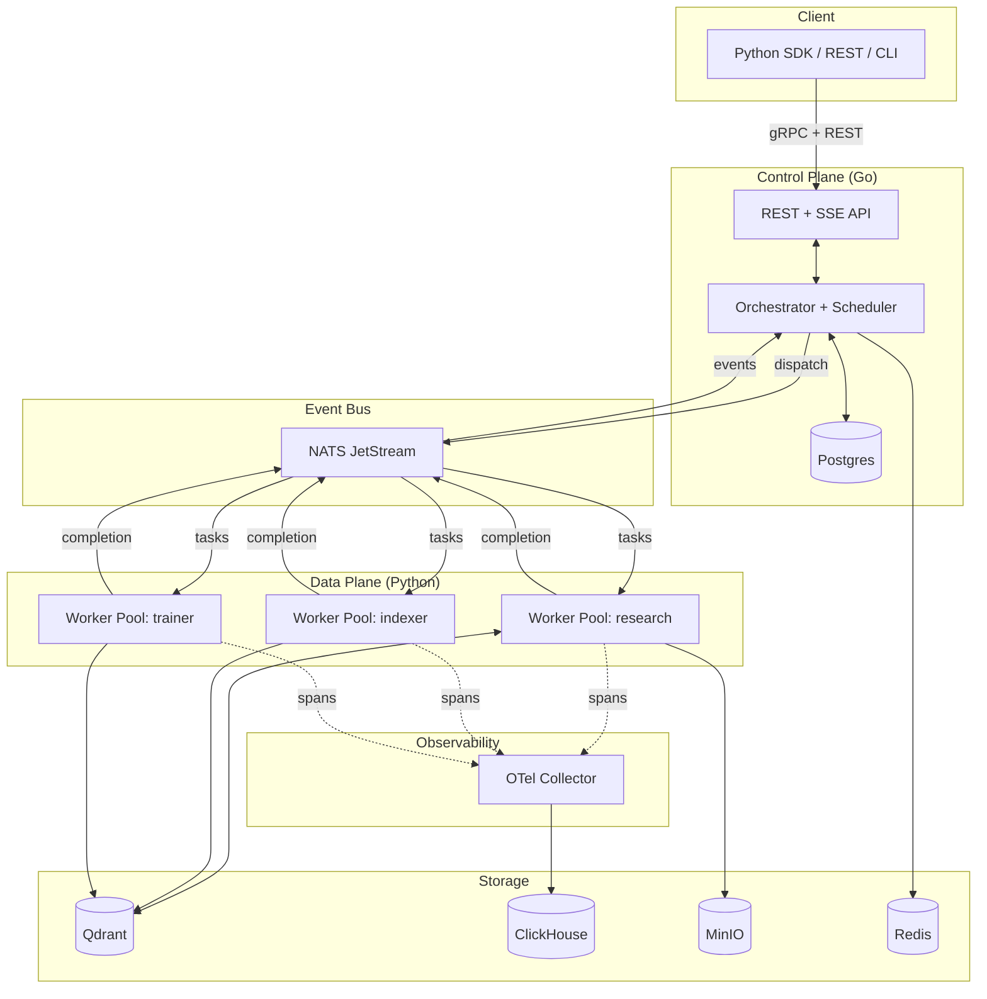

# Architecture

## Overview

Helix splits responsibility across three planes: a Go **control plane** that owns durable state, a Python **data plane** that executes agent code, and an **observability plane** that captures every interaction as a span and feeds the dashboard and eval harness.

The principal design decision is that **execution state is durable and centralized** (Postgres plus checkpoints), while **execution itself is stateless and distributed** (workers can be killed mid-task without data loss). This is the same pattern as Temporal, Cadence, and Inngest; Helix adopts it because LLM workloads have wide latency distributions and frequent transient failures.

## Control plane

### Orchestrator

A single Go service. Receives `submit_run` requests, materializes the workflow DAG, persists it to Postgres, and emits ready-to-run tasks onto NATS subjects keyed by worker pool.

Key responsibilities:

- **Workflow registry.** Workflows are declared in Python via the SDK and registered with the orchestrator at worker startup. The orchestrator stores the workflow definition (DAG topology, retry policies, timeouts) but never executes user code.
- **Run lifecycle.** A run progresses through `pending → running → succeeded | failed | cancelled`. Each transition is a Postgres row update inside a transaction that also emits the corresponding event.
- **Task dispatch.** For each ready task (dependencies satisfied), the orchestrator selects a worker pool, publishes a `task.dispatch` message on NATS, and writes a `task_attempts` row.
- **Retry policy.** Configurable per task: max attempts, backoff curve (exponential with jitter), retryable error classes (rate-limit errors retry; validation errors do not).
- **Checkpointing.** Long-running tasks may emit checkpoints (opaque bytes) that the orchestrator persists. On retry, the worker receives the last checkpoint and resumes from it.
- **Dead-letter queue.** After max retries, tasks land in `dead_letter_queue` with full context for human triage or programmatic replay.

### Scheduler

Logically separate from the orchestrator but lives in the same process. Decides which worker pool gets which task. Initial implementation is round-robin per pool with no load awareness; a follow-up adds least-loaded routing using worker heartbeat data.

### State store

Postgres 15+. Ten core tables. Schema is normalized; Postgres handles all transactional state. Heavy read-only telemetry (spans, eval events) goes to ClickHouse. Full schema in `data-model.md`.

## Data plane

### Workers

Stateless Python processes. Each worker subscribes to one or more NATS subjects (pool topics), executes tasks pulled from those subjects, and emits OTel spans plus completion events.

Worker lifecycle:

1. Connect to the orchestrator over gRPC. Register pool name, capabilities (`llm:claude-sonnet-4`, `tool:web-search`, `tool:code-exec`), max concurrency.
2. Subscribe to NATS subjects derived from pool name.
3. Loop: pull task, deserialize input, look up the workflow handler in the local registry, call it, emit spans, ack the message, post completion event.

Workers are killable at any point. If a worker dies mid-task, the NATS unacked message will be redelivered after the visibility timeout (default 30s). The orchestrator deduplicates by `(task_id, attempt_number)`.

### Tool adapters

Tools are Python callables registered with the worker. Helix provides reference adapters for:

- **LLM calls** via LiteLLM (Anthropic, OpenAI, Together, vLLM)
- **Vector search** via the Helix Qdrant client
- **Web search** via Tavily or SerpAPI
- **Code execution** via a Docker- or Modal-sandboxed Python REPL (optional)

Every tool call is wrapped in an OTel span with input and output payloads. Payloads are truncated to 32 KB inline, with full payloads pushed to MinIO and referenced by URI.

### Sandbox

Optional. For agents that execute model-generated code, Helix supports a Docker-based sandbox with no network, capped CPU and memory, and a 30-second wall clock. The reference research agent does not use it.

## Event bus

NATS JetStream with three streams:

- `helix.tasks.*` — task dispatch from orchestrator to workers. Persistent, at-least-once.
- `helix.events.*` — completion events from workers to orchestrator. Persistent, at-least-once.
- `helix.telemetry.*` — fire-and-forget span data. Persistent, at-most-once is acceptable here because the OTel collector also retries.

Why NATS over Kafka: lower operational overhead, faster cold starts, native support for request/reply and key-value buckets we use for worker heartbeats. Why NATS over Redis Streams: stronger persistence guarantees and a clearer subject/stream model.

## Observability pipeline

Workers emit OpenTelemetry spans via the OTel SDK. An OTel Collector sidecar (or central deployment) receives spans, applies enrichment to resolve `span_id → run_id`, and exports to a ClickHouse writer.

ClickHouse schema is optimized for the trace-viewing and eval queries we know we will run: filter by run, filter by workflow, aggregate by tool name, time-windowed error rate. Full schema in `data-model.md`.

The dashboard queries ClickHouse directly via a thin Go API. The frontend uses TanStack Query with server-sent events for live runs.

## RAG subsystem

The RAG subsystem is the research contribution. Five components, each itself a Helix workflow.

```mermaid
flowchart LR
    Q[Query] --> RET[Retriever<br/>dense + sparse + RRF]
    RET --> RR[Reranker<br/>BGE cross-encoder]
    RR --> Top10[Top-10 passages]
    Top10 --> AGENT[Agent reasoning]
    AGENT --> EVAL[Eval]
    EVAL -- failure --> MINER[Failure Miner]
    MINER --> TRIPLETS[Contrastive triplets]
    TRIPLETS --> TRAINER[Embedding trainer<br/>InfoNCE on Nomic v1.5]
    TRAINER --> CAND[Candidate model]
    CAND --> HOLDOUT[Held-out hard set]
    HOLDOUT -- recall@10 lift --> PROMOTE{Promote?}
    PROMOTE -- yes --> RET
    PROMOTE -- no --> ARCHIVE[Archive]
```

### Indexer

Ingestion workflow. Input: corpus URI (a parquet file of documents). Output: documents chunked, embedded, and written to Qdrant.

Steps:

1. Load and chunk (semantic + structural splits at section boundaries)
2. Embed in batches, GPU-aware if available
3. Upsert to Qdrant with metadata (source, section, doc_id)
4. Write index manifest to Postgres

### Retriever

Online component. Given a query, returns top-k passages. Hybrid retrieval: dense (Qdrant) plus sparse (BM25 via tantivy) with reciprocal rank fusion at the top-50 boundary.

### Reranker

Optional second stage. Cross-encoder (`BAAI/bge-reranker-base`) for top-50 → top-10 reranking. Adds about 200ms but materially improves precision. The reranker stays fixed across experiments so the embedding fine-tune's contribution is isolated.

### Failure miner

Background workflow scheduled hourly. Consumes recent retrieval spans from ClickHouse, joins them against eval outcomes, identifies retrieval failures (queries where the gold passage was not in the retrieved set), and writes them to the `failure_cases` table.

Each failure is automatically categorized into one of four signatures:

- **Lexical-only mismatch** — the gold passage shares no surface tokens with the query.
- **Semantic mismatch** — embedding similarity below threshold despite topical alignment.
- **Multi-hop miss** — first-hop retrieval succeeded, second-hop retrieval failed.
- **Ambiguous query** — multiple plausible gold passages, retriever chose wrong one.

These categories are learned via lightweight rules plus a clustering pass; they also form the empirical taxonomy contribution.

### Embedding trainer

Workflow triggered manually or on cron. Steps:

1. Pull failure cases from the last N days.
2. For each failure, construct contrastive triplets: `(query, gold_passage, hard_negative)`. Hard negatives are sampled from the top-k retrieved-but-wrong passages.
3. Fine-tune the base embedding model (Nomic Embed v1.5) with InfoNCE loss using sentence-transformers.
4. Evaluate the new model against the held-out hard set. Persist results with bootstrap confidence intervals.
5. If recall@10 improvement passes the configured threshold and is statistically significant, promote the new model. Otherwise, archive.

Promotion is implemented as Qdrant alias swap: index the corpus into a new collection with the candidate model, then atomically swap the `corpus.active` alias from `corpus.base` to `corpus.candidate.<job_id>`.

## Failure replay

Every run is replayable. Replay reads the original run's spans from ClickHouse, swaps the LLM and tool calls for a deterministic mock that returns the recorded outputs, and re-executes the workflow code.

Use cases:

- **Regression testing** — run the new agent code against last week's traces; assert no behavior diff.
- **Counterfactual replay** — swap one tool's output for a fixed alternative; observe downstream effects.
- **Debugging** — re-run with verbose logging without burning LLM credits.

Implementation: the worker accepts a `replay_token` in the task envelope. When present, the LiteLLM adapter and tool adapters short-circuit to recorded outputs keyed by span hash.

## Failure modes and recovery

| Failure | Detection | Recovery |
|---|---|---|
| Worker crash mid-task | NATS visibility timeout expires | Message redelivered to another worker; checkpoint resumes from last commit |
| Orchestrator crash | K8s liveness probe | Restart; in-flight gRPC retried by clients; run state intact in Postgres |
| Postgres unavailable | Connection error | Orchestrator returns 503; workers buffer events in NATS until reconnect |
| ClickHouse unavailable | OTel exporter error | Spans buffer at collector (disk-backed queue) up to 1 hour |
| NATS unavailable | Connection error | Critical path: orchestrator falls back to direct gRPC dispatch (degraded mode) |
| LLM provider rate-limit | LiteLLM error | Retry with exponential backoff; after N retries, fail over to secondary provider |
| Embedding model unavailable | Qdrant error or timeout | Retriever falls back to BM25-only |

## Scaling

The reference deployment targets roughly 100 concurrent runs and 10M spans per day on a single Kubernetes cluster. Bottlenecks in expected order:

1. **LLM provider quota.** Addressed by multi-provider fallback in LiteLLM.
2. **Embedding throughput during indexing.** Addressed by sharding to multiple worker pools with GPU nodes.
3. **ClickHouse insert pressure.** Addressed by buffering at the collector and using async inserts for telemetry (synchronous for eval events).
4. **Postgres write pressure on `task_attempts`.** Addressed by partitioning by week (post-M3).

Beyond that, the orchestrator is a single writer to Postgres. Sharding the orchestrator by workflow id is post-v1 work.

## Security

- gRPC mutual TLS between control plane and workers.
- Workflow code is trusted; Helix does not sandbox the workflow process. Tool calls that execute model-generated code use the optional Docker sandbox.
- Secrets (API keys for LLM providers, embedding hub tokens) live in a secrets backend. Env vars in dev, External Secrets Operator + AWS or GCP secret manager in prod. Never logged.
- Trace payloads larger than 32 KB are stored in MinIO with per-tenant prefixes; access controlled by signed URLs.
- No user authentication on the dashboard in v1. Helm chart includes an optional OAuth2 proxy.

## Determinism guarantees

Helix guarantees the following determinism properties:

- **Trace fidelity.** Every span captures inputs, outputs, model version, and tool version. Replay against the same trace produces the same workflow result.
- **Eval reproducibility.** An eval run is parameterized by `(workflow_version, dataset_version, scorer_version, retriever_version, embedding_model_version)`. Same parameters, same result modulo non-deterministic LLM sampling — which the harness pins via `temperature=0` and `seed` where the provider supports it.

What Helix does **not** guarantee: bit-exact LLM output across providers or across the same provider over time. Providers change model weights silently. The eval harness records the provider's model id and date stamp for every call.
